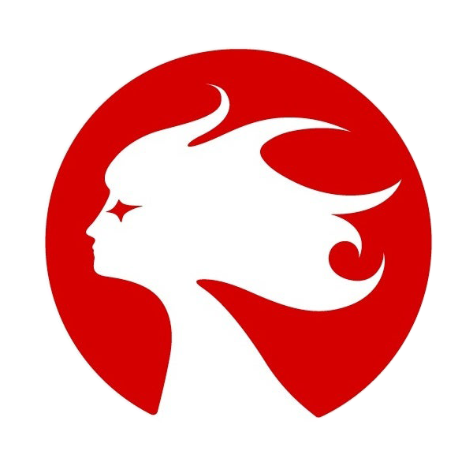

<h1 align="center"><b>Hello，我是胡晓阳 Shwan Hu </b></h1>

**一名正在学习游戏开发的程序员，狂热的游戏爱好者，目前正在游戏公司实习。**

---

<table>
  <tr>
    <td width="120px" align="left">🎓<b>教育背景：</b></td>
    <td>
      <a href="https://www.fudan.edu.cn/">
         复旦大学
      </a>
      软件工程专业就读，预计2026年6月毕业
    </td>
  </tr>
  <tr>
    <td width="120px" align="left">🏢<b>职业经历：</b></td>
    <td>
      <a href="https://www.lilithgames.com/">
         莉莉丝游戏
      </a>
      测试开发实习生（2025.02 - 2025.05） 
      <a href="https://www.nvsgames.cn/">
        字节跳动
      </a>
      朝夕光年 游戏客户端开发实习生（2025.05 - 至今）
    </td>
  </tr>
  <tr>
    <td width="120px" align="left">🕹️<b>游戏玩家：</b></td>
    <td>Steam 8000h+，Switch 300h+，DOTA2 13年骨灰级玩家</td>
  </tr>
  <tr>
    <td width="120px" align="left">🎮<b>开发项目：</b></td>
    <td>
      <a href="https://github.com/ShawnHu0815/Unity-PJ3-KunkunFly">坤坤勇敢飞 KunkunFly Demo</a>
      基于Unity 2D物理引擎的横版跳跃游戏，实现角色动态碰撞检测与跳跃机制
    </td>
  </tr>

</table>

## 🔧 技术栈

  <!-- 编程语言和开发工具 -->
  

    

      
      
      
      
      
      
    

    

      
      
      
      
    

  

  <!-- 版本控制和数据库 -->
  

    

      
      
      
      
      
    

  

---

  
  

---

### 📬 联系方式
- 📧 **邮箱**: xiaoyanghu18@fudan.edu.cn  
- 📱 **微信**: hu979293340

 
   
  

